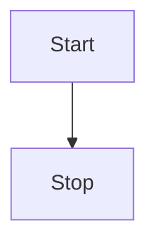
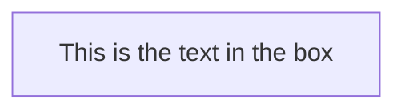
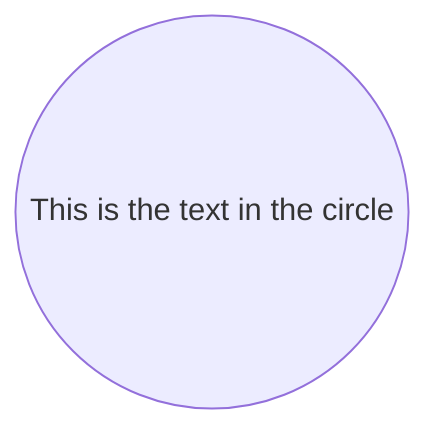
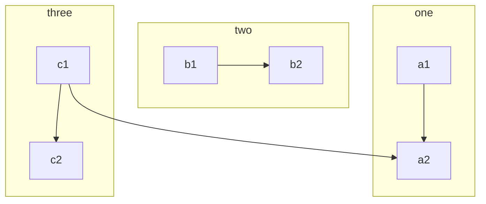
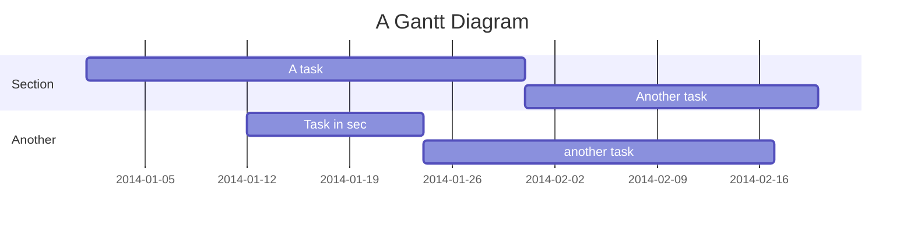

```mermaid

graph TD
    Start --> Stop

```

-----

```mermaid

graph LR
    id1[This is the text in the box]


```

-----

```mermaid

graph LR
    id1((This is the text in the circle))


```

-----

```mermaid

graph TB
    c1-->a2
    subgraph one
    a1-->a2
    end
    subgraph two
    b1-->b2
    end
    subgraph three
    c1-->c2
    end

```

-----

```mermaid

gantt
    title A Gantt Diagram
    dateFormat  YYYY-MM-DD
    section Section
    A task           :a1, 2014-01-01, 30d
    Another task     :after a1  , 20d
    section Another
    Task in sec      :2014-01-12  , 12d
    another task      : 24d

```

