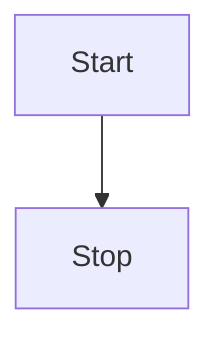

### 流程图
```flow
st=>start: Start
e=>end
op=>operation: My Operation
cond=>condition: Yes or No?

st->op->cond
cond(yes)->e
cond(no)->op
```


### LaTeX 公式

可以创建行内公式，例如 $\Gamma(n) = (n-1)!\quad\forall n\in\mathbb N$。或者块级公式：

$$
x = \dfrac{-b \pm \sqrt{b^2 - 4ac}}{2a}
$$

以及时序图:

```sequence
Alice->Bob: Hello Bob, how are you?
Note right of Bob: Bob thinks
Bob-->Alice: I am good thanks!
```


```seq
Alice->Bob: Hello Bob, how are you?
Note right of Bob: Bob thinks
Bob-->Alice: I am good thanks!
```

### 代码块
``` python
@requires_authorization
def somefunc(param1='', param2=0):
    '''A docstring'''
    if param1 > param2: # interesting
        print 'Greater'
    return (param2 - param1 + 1) or None
class SomeClass:
    pass
>>> message = '''interpreter
... prompt'''
```

```chart
{
  "type": "line",
  "data": {
    "labels": [
      "January",
      "February",
      "March",
      "April",
      "May",
      "June",
      "July"
    ],
    "datasets": [
      {
        "label": "# of bugs",
        "fill": false,
        "lineTension": 0.1,
        "backgroundColor": "rgba(75,192,192,0.4)",
        "borderColor": "rgba(75,192,192,1)",
        "borderCapStyle": "butt",
        "borderDash": [],
        "borderDashOffset": 0,
        "borderJoinStyle": "miter",
        "pointBorderColor": "rgba(75,192,192,1)",
        "pointBackgroundColor": "#fff",
        "pointBorderWidth": 1,
        "pointHoverRadius": 5,
        "pointHoverBackgroundColor": "rgba(75,192,192,1)",
        "pointHoverBorderColor": "rgba(220,220,220,1)",
        "pointHoverBorderWidth": 2,
        "pointRadius": 1,
        "pointHitRadius": 10,
        "data": [
          65,
          59,
          80,
          81,
          56,
          55,
          40
        ],
        "spanGaps": false
      }
    ]
  },
  "options": {}
}
```

```g2
const data = [
    { genre: 'Sports', sold: 275 },
    { genre: 'Strategy', sold: 115 },
    { genre: 'Action', sold: 120 },
    { genre: 'Shooter', sold: 350 },
    { genre: 'Other', sold: 150 }
];

const chart = new G2.Chart({
    forceFit: true,
    container: container,
    height : 300
});
chart.source(data);
chart.interval().position('genre*sold').color('genre')
chart.render();

return chart;
```


